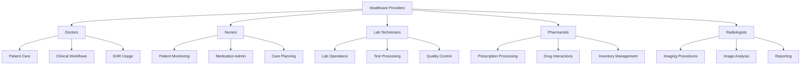
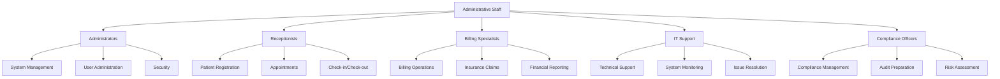
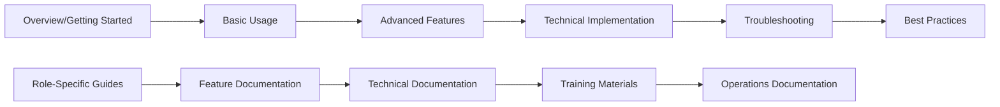

# HMS Enterprise-Grade Documentation Navigation Guide

## 🧭 Navigating the Documentation

This guide helps you navigate the comprehensive HMS Enterprise-Grade documentation effectively.

## 🎯 Quick Navigation by User Type

### Healthcare Providers


### Administrative Staff


## 📚 Documentation Structure

### Level-Based Navigation
```
Level 1: Core Documentation (Getting Started)
├── System Overview
├── Installation & Setup
├── Basic Usage
└── Quick Reference

Level 2: Role-Based Documentation (User Guides)
├── Clinical Staff Guides
├── Administrative Staff Guides
├── Technical Staff Guides
└── Patient & Executive Guides

Level 3: Technical Documentation (Implementation)
├── System Architecture
├── API Documentation
├── Database Documentation
├── Deployment Guides
└── Security & Compliance

Level 4: Training & Certification (Learning)
├── Training Curriculum
├── Video Tutorials
├── Certification Program
└── Interactive Learning

Level 5: Operations Documentation (Maintenance)
├── System Administration
├── Monitoring & Alerting
├── Backup & Recovery
├── Support Procedures
└── Incident Management
```

## 🔍 Search Strategies

### Effective Search Techniques

#### 1. Keyword Search
```bash
# Search for specific features
patient registration
appointment scheduling
billing procedures
lab test ordering

# Search for technical topics
API endpoints
database schema
security configuration
deployment steps

# Search for troubleshooting
error messages
system issues
performance problems
connection issues
```

#### 2. Role-Based Search
```bash
# Search by role
doctor workflow
nurse documentation
pharmacist procedures
receptionist tasks
administrator functions

# Search by department
emergency room procedures
laboratory operations
pharmacy management
radiology imaging
billing department
```

#### 3. Feature-Based Search
```bash
# Search by system features
electronic health records
appointment scheduling
medication management
laboratory integration
insurance verification
patient portal
mobile app access
```

## 🎯 Quick Access Links

### Common Tasks
- **[Patient Registration](docs/roles/receptionists/patient_registration.md)**
- **[Appointment Scheduling](docs/roles/receptionists/appointment_scheduling.md)**
- **[Clinical Documentation](docs/roles/doctors/documentation.md)**
- **[Billing Processing](docs/roles/billing_specialists/charge_entry.md)**
- **[System Administration](docs/roles/administrator/overview.md)**

### Technical Operations
- **[API Reference](docs/technical/apis/rest_api.md)**
- **[Database Schema](docs/technical/databases/schema.md)**
- **[Deployment Guide](docs/technical/deployment/kubernetes/)**
- **[Security Configuration](docs/technical/security/authentication/)**
- **[Troubleshooting](TROUBLESHOOTING.md)**

### Training & Support
- **[Training Portal](docs/training/)**
- **[Video Tutorials](docs/training/videos/)**
- **[Support Procedures](docs/operations/support/)**
- **[Incident Response](docs/operations/incident_management/)**
- **[Best Practices](BEST_PRACTICES.md)**

## 📱 Mobile Navigation

### Mobile-Friendly Features
- **Responsive Design**: Automatic layout adjustment
- **Touch Navigation**: Swipe gestures for navigation
- **Quick Access**: Common features on home screen
- **Search Bar**: Prominent search functionality
- **Offline Access**: Downloadable documentation

### Mobile Navigation Tips
1. **Use Search**: Mobile search is optimized for quick results
2. **Bookmark Pages**: Save frequently accessed documentation
3. **Use Categories**: Navigate by category for better organization
4. **Pinch to Zoom**: Adjust text size for better readability
5. **Landscape Mode**: Use landscape for better viewing of code examples

## 🔄 Cross-Reference Navigation

### Related Topics
Each documentation page includes:
- **Related Features**: Links to related system features
- **Role-Specific Views**: How different roles use the feature
- **Technical Implementation**: Underlying technical details
- **Training Resources**: Associated training materials
- **Support Procedures**: Troubleshooting and support

### Document Flow


## 🎯 Navigation by Use Case

### New User Onboarding
1. **Start Here**: [Quick Start Guide](QUICK_START.md)
2. **System Setup**: [Installation Guide](INSTALLATION.md)
3. **First Login**: [First Login Guide](docs/user_guides/first_login.md)
4. **Role Selection**: Choose your role-specific guide
5. **Basic Training**: [Training Curriculum](docs/training/curriculum/)

### Daily Operations
1. **Role Dashboard**: Navigate to your role-specific dashboard
2. **Task-Specific**: Find your current task documentation
3. **Quick Reference**: Use quick reference guides
4. **Troubleshooting**: Check troubleshooting guides if needed

### Technical Implementation
1. **Architecture**: Understand system architecture
2. **API Reference**: Review API documentation
3. **Database**: Understand database schema
4. **Deployment**: Follow deployment guides
5. **Security**: Implement security measures

### System Administration
1. **User Management**: Manage user accounts and permissions
2. **System Configuration**: Configure system settings
3. **Monitoring**: Monitor system performance
4. **Backup & Recovery**: Implement backup procedures
5. **Incident Management**: Handle system incidents

## 📊 Navigation Analytics

### Popular Navigation Paths
1. **User Registration**: Roles → Receptionists → Patient Registration
2. **Clinical Workflows**: Roles → Doctors → Clinical Workflows
3. **API Integration**: Technical → APIs → REST API
4. **System Setup**: Installation → Configuration → Deployment
5. **Troubleshooting**: Operations → Support → Issue Resolution

### Most Accessed Sections
- **Role-Specific Guides**: 40% of all documentation access
- **API Documentation**: 25% of technical documentation access
- **Troubleshooting**: 15% of support documentation access
- **Training Materials**: 10% of learning documentation access
- **Best Practices**: 10% of reference documentation access

## 🛠️ Navigation Tools

### Built-in Tools
- **Search Bar**: Global search functionality
- **Breadcrumb Navigation**: Clear navigation path
- **Table of Contents**: Expandable table of contents
- **Related Links**: Links to related documentation
- **History**: Recently viewed pages
- **Bookmarks**: Save favorite pages

### External Tools
- **Browser Search**: Use browser search (Ctrl+F)
- **PDF Export**: Download documentation as PDF
- **Print**: Print documentation for offline use
- **Share**: Share documentation links with team members

## 📞 Navigation Support

### Getting Help with Navigation
- **Documentation Support**: docs@hms-enterprise.com
- **Technical Support**: support@hms-enterprise.com
- **Training Support**: training@hms-enterprise.com
- **Community Forum**: https://community.hms-enterprise.com

### Navigation Tips
1. **Use Search**: The search function is your best friend
2. **Start with Your Role**: Begin with role-specific documentation
3. **Follow the Flow**: Use the logical documentation flow
4. **Bookmark Frequently**: Save pages you use often
5. **Check Updates**: Look for recently updated documentation

---

This navigation guide should help you efficiently find the information you need in the HMS Enterprise-Grade documentation system. For additional assistance, please don't hesitate to reach out to our support team.